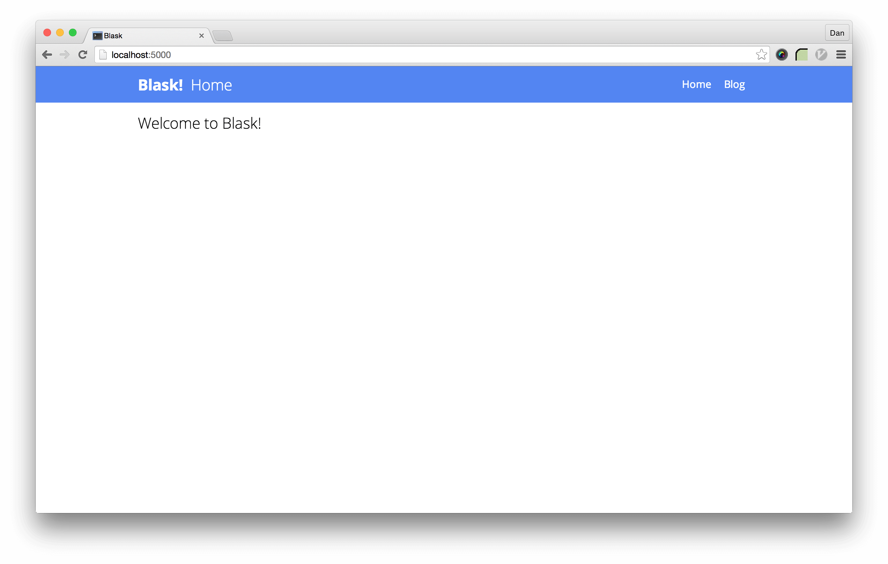
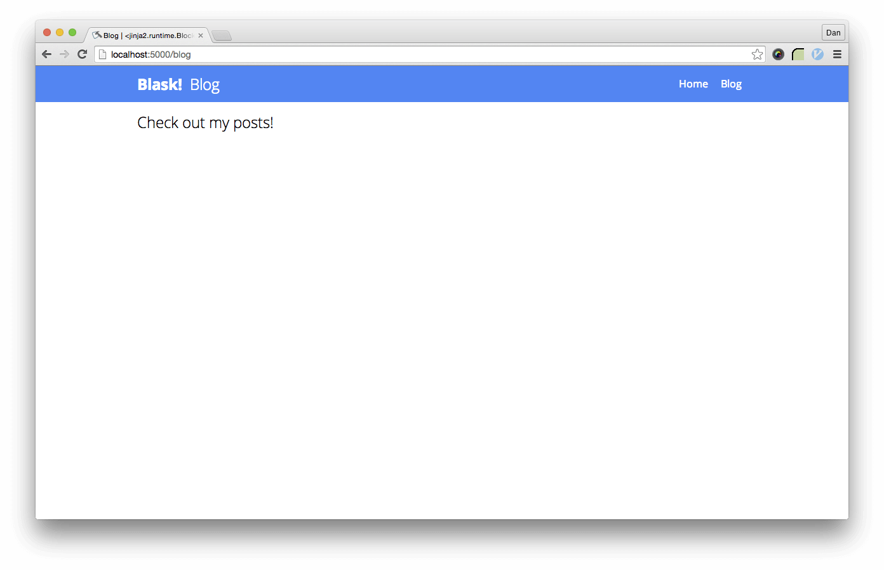
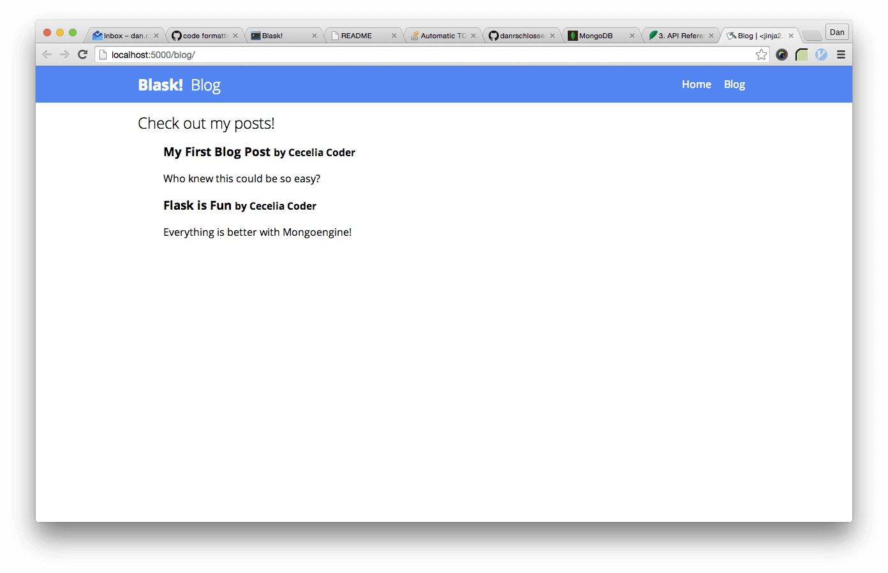
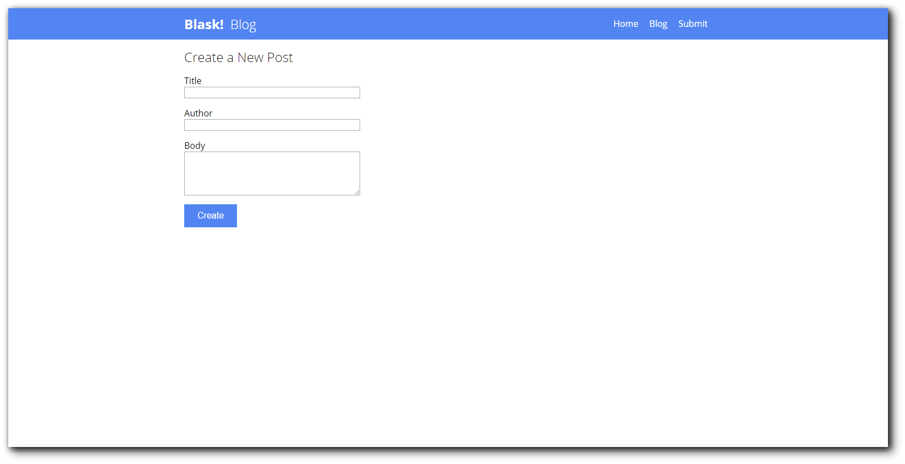
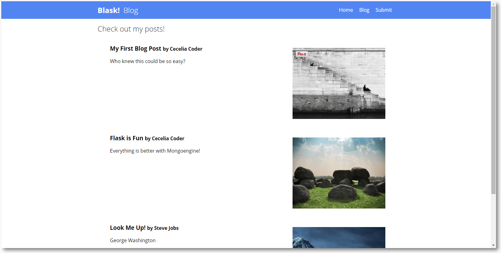
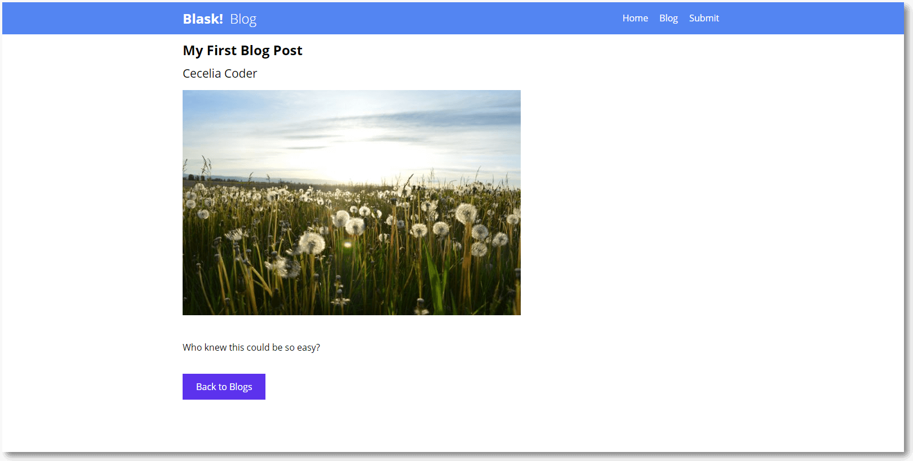

Intermediate Flask
==================

By [Dan Schlosser](http://danrs.ch) and [ADI](https://adicu.com), with help from [Cameron Yick](http://cameronyick.us)

## Table of Contents

- [1.0 Recap: Basic Flask](#10-recap-basic-flask)
    + [1.1 Directory Structure](#11-directory-structure)
    + [1.2 Routing](#12-routing)
    + [1.3 Templating and `url_for`](#13-templating-and-url_for)
- [2.0 Larger Apps in Flask: Using Blueprints](#20-larger-apps-in-flask-using-blueprints)
    + [2.1 A New Directory Structure](#21-a-new-directory-structure)
        * [2.1.1 Python Package Management](#211-python-package-management)
        * [2.1.2 Why Include `run.py`?](#212-why-include-runpy)
    + [2.2 Blueprints](#22-blueprints)
    + [2.3 `url_for` Returns](#23-url_for-returns) 
- [3.0 PIP, Virtualenv, and external libraries](#30-pip-virtualenv-and-external-libraries)
    + [3.1 Using Virtualenv](#31-using-virtualenv)
    + [3.2 Managing Dependencies](#32-managing-dependencies)
- [4.0 Databases with Flask-Mongoengine](#40-databases-with-flask-mongoengine)
    + [4.1 Installation and Setup](#41-installation-and-setup)
    + [4.2 Adding a Model: `BlogPost`](#42-adding-a-model-blogpost)
        * [4.2.1 Working With Models](#421-working-with-models)
        * [4.2.2 Populating the Database](#422-populating-the-database)
    + [4.3 Rendering BlogPosts](#43-rendering-blogposts)
- [5.0 Working with Forms](#50-working-with-forms)
- [6.0 Displaying Items in Collections](#60-displaying-items-in-collections)
    + [6.1 Post Pages](#61-post-pages)
    + [6.2 Picture Placeholders](#62-picture-placeholders)

## 1.0 Recap: Basic Flask

In case you need a refresh, here's a lightning-speed introduction to Flask

### 1.1 Directory Structure

In a basic flask app, This is our directory structure.

```bash
├── app.py          # Application logic
├── static/         # Static content
│   ├── css/        # CSS stylesheets
│   ├── img/        # Images
│   └── js/         # JavaScript files      
└── templates/      # HTML pages
```

All of our Python code lives in `app.py`, and to run the program we run `python app.py`. Static content lives in the `static` folder, and all HTML pages live in the `templates` folder.

If you would like more review, check out ADI's [introduction to Flask tutorial][intro-flask].

### 1.2 Routing

For our sample blog in Flask, or "Blask" as we'll call it, the `app.py` file is fairly simple. 

```python
from flask import Flask, render_template

app = Flask(__name__)

app.config['DEBUG'] = True

@app.route('/')
def home_page():
    """The home page."""
    return render_template('home.html')

@app.route('/blog')
def blog_page():
    """The blog page."""
    return render_template('blog.html')

if __name__ == '__main__':
    app.run(host='0.0.0.0', port=5000)
```

The `@app.route()` decorator creates a *route* in Flask.  A URL endpoint can be accessed at [`http://localhost:5000`](http://localhost:5000).  So in Blask, the url [`http://localhost:5000/`](http://localhost:5000/) will show the contents of `home.html` and [`http://localhost:5000/blog`](http://localhost:5000/blog) will show the contents of `blog.html`.

### 1.3 Templating and `url_for`

In our main template, `home.html`, we define three important [Jinja blocks][jinja-blocks]:

- `` defines the title of the webpage.  We should change this for each other page.
- `` is the name of the current page, and is displayed next to the main website header, `Blask!`.
- `` defines the rest of the page. In order to keep the navbar the same across pages, we leave the `<nav>` element outside the content block.  This block will change page to page.

```html
<html>
<head>
  <title>Blask!</title>
  <link rel='stylesheet' 
      type='text/css'
      href='http://fonts.googleapis.com/css?family=Open+Sans:400italic,700,300,400'>
  <link rel="stylesheet" 
      type="text/css" 
      href="{{ url_for('static', filename='css/style.css') }}">
</head>
<body>
  <nav>
    <div class="content">
      <h1><a href="/">Blask!</a></h1>
      <h2>Home</h2>
      <ul class="menu">
        <li>
          <a href="{{ url_for('home_page') }}">Home</a>
        </li>
        <li>
          <a href="{{ url_for('blog_page') }}">Blog</a>
        </li>
      </ul>
    </div>
  </nav>

  <div class="content">
    
    <h2>Welcome to Blask!</h2>
    
  </div>

  <script src="{{ url_for('static', filename='js/script.js') }}"></script>
</body>
</html>

```

Here's what the home page of Blask looks like.  There's some CSS that will be applied to the project, but we won't dive into it too much.



In the `<link href="">`, `<a href="">`, and `<script src="">` tags, the `url_for` function is used, in double braces.

If you pass the string `static` and a filename in the `static/` folder, it will return the URL path to that asset.  If you pass the name of a route function (here, the ones from `app.py`), it returns the URL for that route.

Using `url_for` allows us to not worry about changing around URLs in our Python code, because the templates will always refer to the same function names.

The `blog.html` file is slightly more interesting:

```html

Blog | {{ super() }}
Blog


<h2>Check out my posts!</h2>

```

It *extends* from `home.html`, which means it is identical to `home.html`, except any Jinja blocks defined in `blog.html` will be substituted in.  So here, our blog page will have a different `title`, `current_page`, and `content`.  

The [super() block](http://jinja.pocoo.org/docs/dev/templates/#super-blocks) returns the contents of the title in the parent block. In this case, that is 'Blask!'



## 2.0 Larger Apps in Flask: Using Blueprints

### 2.1 A New Directory Structure

Our traditional app structure places all of our Flask routes in a file called `app.py` in the root folder.  This is fine for smaller applications, but as our app grows we'll want to break this up into multiple files. Moreover, we'll want to include unit tests, configuration, data files, documentation, scripts, and more in our application as it grows.  To accomplish this, we'll develop a directory structure in which the web app is only one component.

Here's what we'll be moving to:

```bash
├── app/                # Anything connected to the webapp
│   ├── __init__.py     # Core application logic
│   ├── routes/         # Routing
│   │   └── __init__.py # Empty file
│   ├── static/         # Static content
│   │   ├── css/        # CSS stylesheets
│   │   ├── img/        # Images
│   │   └── js/         # JavaScript files
│   └── templates/      # HTML pages
└── run.py              # The boot script
```

The `app` folder holds the entire web application.  Next to it in the same directory is where we will put tests, auxiliary scripts, and configuration files. Inside it, `__init__.py` takes the role of what `app.py` did before.  It creates an instance of the `Flask` class, etc:

```python
from flask import Flask

app = Flask(__name__)
app.config['DEBUG'] = True
# ...
```

The `static` and `templates` folders perform similar functions as they did before.  On the other hand, routes will be moved out of `app.py` and into their own files within the `routes` folder.  Every file in here will be represent a Blueprint, but we're getting ahead of ourselves (that's coming up next).  For reasons that will be explained in the next section, we also need a file called `__init__.py` in the `routes` folder.

The last file to look at is `run.py`. It's pretty short:

```python
from app import app

if __name__ == '__main__':
  app.run(host='0.0.0.0', port=5000)
```

What it does is import the `Flask` instance called `app` from `app/__init__.py`, and call `app.run()` on it once the script is executed.  This is pretty confusing, so lets look into how this works, and then why.

#### 2.1.1 Python Package Management

In python, we can use import syntax like `import <x>` or `from <x> import <y>` on our local directory structure to access variables from multiple files.

In Python, a `module` is a file that contains methods, and a `package` is a folder full of modules, including one called `__init__.py`. Recognize that filename?  When we used  `app/__init__.py` as the filename for our core application logic, we did it for a reason.  In our new directory structure, `app` is a python package.  Same is true for `app/routes/__init__.py`.  The `__init__.py` file can contain logic, or can be empty.

When we write `from app import <x>`, `<x>` can be either:

- Any `.py` file in the `app` folder, or
- Any root-scope variable in `app/__init__.py`.  

So in `run.py`, when we write

```python
from app import app
```

We are importing the Flask instance, `app`, from the `__init__.py` file in the `app` package.

#### 2.1.2 Why Include `run.py`?

We could just as easily put the contents of `run.py` into `app/__init__.py`, and then start the server by doing:

```bash
$ cd app
$ python __init__.py
 * Running on http://0.0.0.0:5000/
 * Restarting with reloader
```

So why not?  Because of how the python package management system works, we need the python file that we execute using `python <file.py>` to be in the same directory as (or in a parent directory of) any modules or packages that we want to import from.  For example, if we wanted to import variables from `app/folder/myvariables.py` in our route `app/routes/blog.py`, we need our original executable python file in the same directory as the `app/` folder. 

Now, in `app/routes/blog.py` we can do

```python
from app.folder.variables import important_variable
```

By running our app from `run.py`, we allow any python file in any directory import from any other file.  This will become very useful, especially as we start adding more complex directory structures.

### 2.2 Blueprints

To allow splitting up of our routes into multiple files, we can take advantage of a powerful feature in Flask called [Blueprints][blueprints].  A Blueprints, practically, are a way to modularize routes.  It allows routes to be defined, referenced, and written in groups.  Here's how it works:  First, create a Blueprint object, in `app/routes/home.py`:

```python
from flask import Blueprint

home = Blueprint('name', __name__)
```

Then, define routes, using the `route()` decorator on the Blueprint, rather than on our Flask object (`app`):

```python
from flask import Blueprint, render_template

home = Blueprint('name', __name__)

@home.route('/')
def home_page():
    """The home page."""
    return render_template('home.html')
```

Finally, we "register" the blueprints to our Flask object (`app`) in `app/__init__.py`, effectively connecting the blueprint to the rest of the app.  To do this, we import the Blueprint objects, then call `app.registerBlueprint()` on them.

```python
from flask import Flask

app = Flask(__name__)

app.config['DEBUG'] = True

# Import and register the Blueprints
from app.routes.home import home
app.register_blueprint(home)
```

We can easily add more Blueprints by adding more files into the `routes` folder, and importing / registering.  Take `app/routes/blog.py`.  Here, we register the Blueprint with a `url_prefix`, which will be prepended to the URLs for any routes defined on the blueprint.

```python
from flask import Blueprint, render_template

# Create the blog Blueprint.  Note that all routes on the blog blueprint have
# '/blog' prepended to them.
blog = Blueprint('blog', __name__, url_prefix='/blog')

@blog.route('/')  # Accessible at /blog/
def blog_page():
    """The blog page."""
    return render_template('blog.html')
```

Then just update `app/__init__.py` and we're done!

```python
from flask import Flask

app = Flask(__name__)

app.config['DEBUG'] = True

# Import and register the Blueprints
from app.routes.blog import blog
from app.routes.home import home
app.register_blueprint(blog)
app.register_blueprint(home)
```

### 2.3 `url_for` Returns

If you try to run our app in its current state, you'll get a `werkzeug.routing.BuildError: ('home_page', {}, None)`.  

Because our routes are now spread across multiple modules, we need to use the Blueprint name to specify which module the desired route lives in.  The string inside a call to `url_for` is `blueprint_name.function_name`.  We can very easily update `home.html` to reflect this:

```html
...
<ul class="menu">
  <li>
    <a href="{{ url_for('home.home_page') }}">Home</a>
  </li>
  <li>
    <a href="{{ url_for('blog.blog_page') }}">Blog</a>
  </li>
</ul>
...
```

And now our app should run! You shouldn't notice any changes in what the app looks like, but under the hood we are now ready to quickly expand to a larger application!

## 3.0 PIP, Virtualenv, and External Libraries

### 3.1 Using Virtualenv

In sections that follow, we'll be using external libraries too add functionality to our Flask app.  Flask was designed to be minimalist (they call it a ["microframework"][flask]), and it allows easy inclusion of external libraries and services.

To manage these external libraries, we'll be using `pip`.  You can install it [here][pip].

Next, we need to install Virtualenv, a tool that lets us specify the exact environment that we want to be in as we run our app.

```bash
$ pip install virtualenv
```

Now, we can create our virtual environment by typing the following (note the `.` at the end):

```
$ virtualenv --no-site-packages .
```
> As of July 27 2015, `--no-site-packages` is default behavior, so the flag is deprecated. Run with:
```
$ virtualenv .
```

> Then, enter the virtual environment by typing
```
$ source bin/activate
```

We know we are in the virtual environment because of the `(blask)` that appears before our prompt.

From within here, we can install packages that we need.  If you haven't already, you should install Flask from within the virtual environment:

```
(blask)$ pip install flask
```
> To exit the virtual environment, type `deactivate`

```
$ deactivate
```

*Note that once you add MongoDB to your app, `python run.py` will only work if called from within your virtual environment. Otherwise, there will be error messages about modules that failed to import.* 

### 3.2 Managing Dependencies

Every time we install an external library, we can save our dependencies in a file called `requirements.txt`.  To create it, run

```
(blask)$ pip freeze > requirements.txt
```

This file is just a list of libraries and version numbers that your app depends on. Now, when someone else clones your project, they can enter the virtual environment and type

```
(blask)$ pip install -r requirements.txt
```

to install all necessary dependencies in one go.  There's no need to type `pip install <package>` for each one.

## 4.0 Databases with Flask-Mongoengine

To use [MongoDB][mongodb] with Flask, we'll be using [Mongoengine][mongoengine].  More specifically, we'll be using [Flask-Mongoengine][flask-mongoengine], a library that integrates Mongoengine into Flask.

### 4.1 Installation and Setup

First, install [MongoDB][mongodb] on your computer.

Next, install Flask-Mongoengine from within the virtualenv:

```bash
pip install flask-mongoengine
pip freeze > requirements.txt
```

Then, in `app/__init__.py`, instantiate the Mongoengine database object:

```python
from flask import Flask
from flask.ext.mongoengine import MongoEngine

app = Flask(__name__)

app.config['DEBUG'] = True
app.config['MONGODB_SETTINGS'] = { 'db': 'blask' }

db = MongoEngine(app)
# ...
```

From anywhere in the app, we can access the database by importing it:

```python
from app import db
# functions on `db`...
```

### 4.2 Adding a Model: `BlogPost`

Our database models represent what our database objects will look like.  We'll put them in a new package underneath `app` called `models`. Don't forget `app/models/__init__.py`!

```bash
├── README.md
├── app/
│   ├── __init__.py
│   ├── models/             # We add a new `models` package
│   │   ├── __init__.py     # This file can be empty
│   │   └── blog.py         # Here, we'll put our model
│   ├── routes/
│   │   ├── __init__.py
│   │   ├── blog.py
│   │   ├── home.py
│   ├── static/
│   │   ├── css/
│   │   ├── img/
│   │   └── js/
│   └── templates/
├── requirements.txt
└── run.py
```

Now, in `app/models/blog.py`, we'll create a new model, which is a class that extends the `db.Document` class from Flask-Mongoengine.

```python
from app import db

class BlogPost(db.Document):
    author = db.StringField(required=True, max_length=100)
    title = db.StringField(required=True, max_length=100)
    body = db.StringField(required=True)
```

Our `BlogPost` class defines attributes `author`, `title`, and `body`, which are *fields* on our model.  They are set to Mongoengine `StringField` instances.  We've configured these fields to be all required. We've also given the title a maximum length.

#### 4.2.1 Working With Models

Now, we can create an instance of the `BlogPost` class, and call the `save()` function on it, to persist it to our MongoDB database:

```python
post = BlogPost(author='Cecelia Coder', 
                title='My First Blog Post',
                body='Who knew this could be so easy?')
post.save()  # The post is now persisted to the database.
```

We can fetch it back by id, or by any of the fields.  Once `save()` has been called on Mongoengine model instances, they then have a `id` attribute that is the ID of the post.  We can then use the `objects().get(id=<id>)` function on our model class to retrieve it.

```python
the_id = post.id
some_post = BlogPost.objects().get(id=the_id)

some_post.author == post.author  # True
some_post.title == post.title    # True
# etc...
```

Alternately, we can get a list of all posts that meet certain requirements with the `objects()` function.

```python
# Here, we print out the titles for all the posts written by Cecelia
many_posts = BlogPost.objects(author='Cecelia Coder')
for post in many_posts:
    print post.title
```

#### 4.2.2 Populating the Database 

To do this in our app, we can write a script called `reset_db.py` that wipes our database and adds two new blog posts.  To do this, we can use the `connect` function to access the database from outside flask.  

```python
from mongoengine import connect

connect('blask')
```

Then, we call `drop_collection` on the `BlogPost` model to wipe any existing posts.

```python
from mongoengine import connect
from app.models.blog import BlogPost

connect('blask')
BlogPost.drop_collection()
```

Finally, we create an save some `BlogPost` objects.  Here's the full script:

```python
from mongoengine import connect
from app.models.blog import BlogPost

connect('blask')
BlogPost.drop_collection()
post1 = BlogPost(author='Cecelia Coder',
                 title='My First Blog Post',
                 body='Who knew this could be so easy?')
post2 = BlogPost(author='Cecelia Coder',
                 title='Flask is Fun',
                 body='Everything is better with Mongoengine!')
post1.save()
post2.save()
```

### 4.3 Rendering BlogPosts

To make our blog posts show up in our blog, we'll first edit our `blog_page` route to send our posts into `render_template`.

```python
from app.models.blog import BlogPost
# ...
@blog.route('/')  # Accessible at /blog/
def blog_page():
    """The blog page."""
    posts = BlogPost.objects()
    return render_template('blog.html', posts=posts)
```

This ensures that the `posts` variable exists in the templates, and has a list of all blog posts as it's value.

Now, we can edit `blog.html` to display them:

```html
...

<h2>Check out my posts!</h2>

<ul class="posts">

    <li class="post">
        <h3>{{ post.title }} <small>by {{ post.author }}</small></h3>
        <p>{{ post.body }}</p>
    </li>

</ul>

```

And voila! Now if we go to `http://localhost:5000/blog/`, you should see a list of blog posts.



## 5.0 Working with Forms

So now you can display blog posts, but how can you add new blogposts to the database? With forms!
The Flask framework has the WTForms library built-in, so you don't need to install any new packages. Let's get started!

### Instructions

Add a Secret Key to `app/__init__.py` . This allows you to make the database only approve forms if they're submitted from within the app.
```python
app.config['DEBUG'] = True
app.config['MONGODB_SETTINGS'] = {'db': 'blask'}
app.config['SECRET_KEY'] = 'another random string'
```

Now let's edit the `model/blog.py` file. Import the `model_form` function and call it on the BlogPost class at the bottom.
```
from app import db
from flask.ext.mongoengine.wtf import model_form

class BlogPost(db.Document):
    ...

BlogPostForm = model_form(BlogPost)
```

Now the database knows what a new form looks like, but how does the form get there? Let's edit the `routes/blog.py` file.

First, import the `redirect, url_for, request` functions from flask (covered in the [previous Flask tutorial][intro-flask]. 

Then, add the BlogPostForm object that we just declared in `models/blog.py` from app.models.blog

```
from flask import Blueprint, render_template, redirect, url_for, request
from app.models.blog import BlogPost, BlogPostForm
...
```

It's time to setup a new route! If you did the previous [tutorial][intro-flask], the code will be familiar. Add this to the bottom of `routes/blog.py`
```
@blog.route('/new', methods=['GET', 'POST'])
def new():
    """Create a new post"""
    form = BlogPostForm(request.form)

    if request.method == 'POST' and form.validate():
        form.save()
        return redirect(url_for('blog.blog_page'))

    return render_template('new.html', form=form)
```
If a form is submitted to the `localhost:5000/blog/new` route, `form.validate()` will compare the `csrf_token` with the secret key. If everything is valid, the form will be saved to the database. Otherwise, the user will be redirected to the form submission page. Note that the rendered form is auto-populated with the fieldnames of a `BlogPostForm` object. To make use of them though, you'll still need to know what properties to render in your HTML page. 

All right! The logic is taken care of, so now it's time to take care of styling and actually displaying the new blog posts form.

First, add some basic form styling to `style.css`
```css
/* Form styles */

form div {
  margin-bottom: 1rem;
}

form input[type="text"] {
  width: 20rem;
}

form textarea {
  width: 20rem;
  height: 5rem;
}

form input[type="submit"] {
  border: none;
  outline: none;
  background-color: #5385F2;
  color: white;
  cursor: pointer;
  font-size: 1rem;
  padding: 0.75rem 1.5rem;
}

label {
  width: 5rem;
  display: block;
}
```

Almost there! Now, create a file under `templates` called `new.html`. Note `form.csrf_token`: this token gets compared with the "secret key" property in your `app/__init__.py` file as a security measure protecting against form submissions from other websites.

> `csrf` stands for *cross-site request forgery*. If you're curious, you can read more [here](http://stackoverflow.com/questions/5207160/what-is-a-csrf-token-what-is-its-importance-and-how-does-it-work) 

```html

Blog | {{ super() }}
Blog


<h2>Create a New Post</h2>

<form action="" method="POST">
  {{ form.csrf_token }}
  <div>
    {{ form.title.label}}
    {{ form.title }}
  </div>
  <div>
    {{ form.author.label }}
    {{ form.author }}
  </div>
  <div>
    {{ form.body.label }}
    {{ form.body }}
  </div>
  <input type="submit" value="Create">
</form>

```

**BONUS**
As a challenge, add a button for creating these new posts. Place this link inside a button or `<li>` of your choice!
```    
    <a href="{{ url_for('blog.new') }}">Submit</a>
```



## 6.0 Displaying Items in Collections
*Reference Code is in Blask-6*

If your blog posts have longer bodies, you may want them to be displayed on their own page, separate from the list of all pages. Let's make a new route in `routes/blog.py` to give each post its own page.

Before we get into the application logic, here are some additional styles to add to the bottom of `static/css/styles.css`. It is based loosely off of BEM (Block Element Modifier) CSS syntax.

```css
/*Styles for the Blog Post Page*/
.post {
  display:block;
  overflow: auto; /*Fixes Clearfix Issue*/
}

.post__img-thumb {
  float:right;
  margin: 30px 30px; 
}

.post__img-full {
  margin-bottom:30px;
}

.post__author {
  font-size: 1.3rem;
  line-height: 1.5rem;
  font-weight: 400;
}

.post__button {
  border: none;
  outline: none;
  background-color: #5C32ED;
  color: white;
  cursor: pointer;
  font-size: 1rem;
  padding: 0.75rem 1.5rem;
  display:inline-block;
  margin-top: 20px;
  text-decoration:none;
}
```
### 6.1 Post Pages

Let's dive in! The syntax for grabbing a variable from the URL is a review from the [Intro Flask Tutorial][intro-flask]

```python
...
@blog.route('/view/<id>')
def view(id):
    """View contents of a blog post"""
    post = BlogPost.objects.get_or_404(id=id)
    return render_template('post.html', post=post)
```

We're using the `get_or_404` method from the `flask-mongoengine` module, which returns a post based on the post's `ObjectID`. Every BlogPost automatically gets one upon creation.

Next, let's create `templates/post.html` for the post pages. We'll display all the fields related to the post (author, title, and body). We'll also include a button for getting back to the general blogs pages.

```html

Blog | {{ super() }} | post.title 
Blog


    <h1>{{ post.title }}</h1>
    <h2 class="post__author"> {{ post.author }}</h2>
    <p> {{ post.body }}</p>
    <a class="post__button" href="{{ url_for('blog.blog_page') }}">Back to Blogs</a>

```

Now, let's edit the `templates/blog.html` page to give easy access to each post page. Use jinja's inline syntax to pass the post's id to the route.

```html
<ul class="posts">
    
        <li class="post">
         <a href="{{ url_for('blog.view', id=post.id) }}">View Post</a>
            <h3>{{ post.title }} <small>by {{ post.author }}</small></h3>
            <p>{{ post.body }}</p>
        </li>
    
</ul>
```
Tadaa! You've created a way to access and view individual blog posts pages!

### 6.2 Picture Placeholders

Now, if you're prototyping an application you may not time to design proper images for all your dummy content. Fortunately, there are many ways to gather placeholder content. Some are basic random text generators (hipster ipsum, bacon ipsum), some generate specific random content (ex usernames and locations), and some generate placeholder images (placehold.it, cat placeholder, etc). We're going to use a service that uses free images from Unsplash. 

You can read about how to use the Unsplash.it API [here](https://unsplash.it/). They currently have 726 images available. Let's add the following to `blog.html` before breaking it down in chunks.

```html
...
<ul class="posts">
    
    
        <li class="post">
         <a href="{{ url_for('blog.view', id=post.id) }}"></a>
            <h3>{{ post.title }} <small>by {{ post.author }}</small></h3>
            <p>{{ post.body }}</p>
        </li>
    
</ul>
...
```
The first thing we've done is replace the generic "new post" link with a stylish image.

> ``

Basic usage of Unsplash API works is as follows, visit the API documentation for more complex usage.

> `https://unsplash.it/<width>/<height>/<picture_id>`

Next, we're using the native "random" and "range" functions in Jinja to generate random numbers, and use them in the call to Unsplash. Read more about jinja filters [here](http://jinja.pocoo.org/docs/dev/templates/#random)

> ``





Almost done! Now let's add the random picture to the blog post page as well.

```html

    <h1>{{ post.title }}</h1>
    <h2 class="post__author"> {{ post.author }}</h2>
    
    <a href="{{ url_for('blog.view', id=post.id) }}"></a>
    <p> {{ post.body }}</p>
    <a class="post__button" href="{{ url_for('blog.blog_page') }}">Back to Blogs</a>

```




**Bonus:**
In this demo example, the random picture used on the `blogs.html` page will be different from the one that shows on your `post.html` page. However, you can add a parameter to your route to pass the picture id number so that the same picture is rendered in both places.

Note- In real life, you may not want to exposure the post's object ID to the public url for security reasons. You should use a `slug` field or perhaps a `rowID` field instead.


## License

<a rel="license" href="http://creativecommons.org/licenses/by-nc/4.0/"></a>

[jinja-blocks]: http://jinja.pocoo.org/docs/dev/templates/#template-inheritance
[blueprints]: http://flask.pocoo.org/docs/0.10/blueprints/
[flask]: http://flask.pocoo.org/ 
[pip]: https://pip.pypa.io/en/latest/installing.html
[mongoengine]: http://docs.mongoengine.org/index.html
[mongodb]: https://www.mongodb.org/
[flask-mongoengine]: http://flask-mongoengine.readthedocs.org/en/latest/
[intro-flask]: http://learn.adicu.com/webdev/
